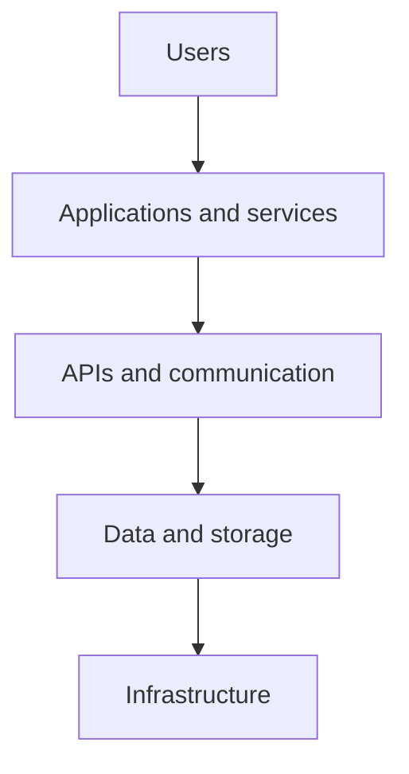
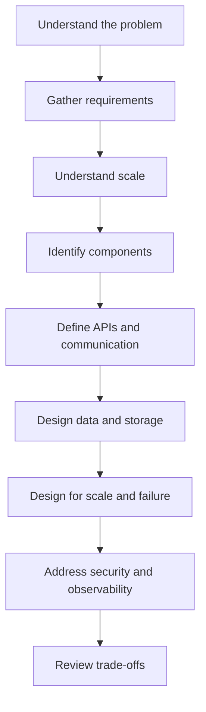

# Day 1: System Design Fundamentals

## Table of contents

- [1. What is system design?](#1-what-is-system-design)
- [2. Why do we need system design?](#2-why-do-we-need-system-design)
- [3. What is the difference between HLD and LLD?](#3-what-is-the-difference-between-hld-and-lld)
- [4. What are the key building blocks of a system?](#4-what-are-the-key-building-blocks-of-a-system)
- [5. What is the difference between functional and non-functional requirements?](#5-what-is-the-difference-between-functional-and-non-functional-requirements)
- [6. What should I do first when given a system design problem?](#6-what-should-i-do-first-when-given-a-system-design-problem)
- [7. What is the typical system design process?](#7-what-is-the-typical-system-design-process)
- [8. Why is scale important in system design?](#8-why-is-scale-important-in-system-design)
- [9. How should I approach a real-world example like Instagram?](#9-how-should-i-approach-a-real-world-example-like-instagram)
- [10. Why do architects care about trade-offs?](#10-why-do-architects-care-about-trade-offs)
- [11. Why should I think about failures while designing?](#11-why-should-i-think-about-failures-while-designing)
- [12. What does "design for scalability" mean?](#12-what-does-design-for-scalability-mean)
- [13. What does a good system design answer look like?](#13-what-does-a-good-system-design-answer-look-like)
- [14. What questions should I ask myself when designing a system?](#14-what-questions-should-i-ask-myself-when-designing-a-system)
- [Quick revision](#day-1-quick-revision)
- [Self-test](#day-1-self-test)

---

## 1. What is system design?

System design is the process of deciding how different technical components should work together to solve a business problem.

As a system grows, consider its:

- Users and requirements
- Application components
- Data
- Communication
- Scalability
- Reliability
- Security
- Trade-offs

> [!TIP]
> Start with the problem, not with the technology.

## 2. Why do we need system design?

A simple solution may work for a small number of users. As users, traffic, and data grow, new problems appear.

System design helps us think about:

- Handling more users
- Keeping the system fast
- Avoiding single points of failure
- Recovering from failures
- Securing the system
- Controlling cost and complexity

> [!IMPORTANT]
> System design becomes important when a simple solution is no longer enough.

## 3. What is the difference between HLD and LLD?

### High-Level Design (HLD)

HLD focuses on the big picture:

- Major components and services
- Databases
- APIs and communication
- Deployment architecture

### Low-Level Design (LLD)

LLD focuses on implementation details:

- Classes and objects
- Methods and interfaces
- Design patterns

**A simple way to remember:**

- **HLD:** How the system is structured
- **LLD:** How individual components are implemented

For your solution architect preparation, HLD should be your main focus initially.

## 4. What are the key building blocks of a system?

At a high level, a system often looks like this:



As the system grows, other components may be introduced:

- Load balancer
- Cache
- Message queue
- Content delivery network (CDN)
- API gateway

Don't memorize technologies yet. Instead, ask: **What problem does each component solve?**

## 5. What is the difference between functional and non-functional requirements?

### Functional requirements

Functional requirements describe **what the system should do**.

For Instagram, examples include:

- Upload a photo
- Follow a user
- Like a post
- Comment on a post
- View a feed

### Non-functional requirements (NFRs)

NFRs describe **how well the system should work**. Examples include:

- Fast
- Scalable
- Available
- Reliable
- Secure

> [!NOTE]
> Functional requirements tell us what to build. Non-functional requirements influence how we build it.

## 6. What should I do first when given a system design problem?

Understand the problem and gather requirements. Don't immediately start drawing:

```text
Kafka -> Redis -> Kubernetes -> MongoDB
```

First, ask:

- Who are the users?
- What are they trying to do?
- What features are required?
- What is out of scope?
- What scale should we expect?
- Which non-functional requirements matter most?

> [!TIP]
> Requirements first. Architecture second. Technology third.

## 7. What is the typical system design process?

A practical sequence is:



You don't need to memorize this word-for-word. Focus on understanding the sequence of thinking.

## 8. Why is scale important in system design?

An architecture that works for 1,000 users may not work for 10 million users. Consider:

- Number of users
- Requests per second
- Peak traffic
- Data volume
- Read/write ratio

For now, focus on the concept. You'll learn capacity estimation in more detail later.

## 9. How should I approach a real-world example like Instagram?

Don't try to design all of Instagram at once. Start with one simple requirement:

> Users should be able to upload photos, and their followers should be able to see them.

Then ask:

- How does the request reach the application?
- Where is the image stored?
- Where is post information stored?
- How do we know who follows whom?
- How is the feed generated?
- What happens when traffic increases?
- What happens when a component fails?

> [!TIP]
> Break a large system into smaller problems.

## 10. Why do architects care about trade-offs?

There is usually no perfect solution. A decision may improve one quality while making another more difficult.

For example:

- More availability can require more infrastructure and increase cost.
- More services can enable independent scaling but add operational complexity.

> [!IMPORTANT]
> Good architecture is not about finding the perfect solution. It is about choosing a solution that fits the requirements and accepting its trade-offs.

## 11. Why should I think about failures while designing?

Production systems fail. Servers and networks can fail, databases can become unavailable, APIs can slow down, and dependencies can stop responding.

Instead of asking only, "What happens when everything works?" also ask:

> What happens when something fails?

This mindset becomes especially important as you progress into distributed systems and site reliability engineering (SRE).

## 12. What does "design for scalability" mean?

It means designing a system so that it can handle an increasing workload without a major degradation in performance or reliability.

For example:

```text
100 users -> 1,000 users -> 100,000 users -> 10 million users
```

The architecture should have a path to support that growth. You don't need to learn specific scaling techniques on Day 1.

## 13. What does a good system design answer look like?

A good answer shouldn't just be a diagram. It should explain **why each major component exists**.

For example, don't just say:

> We'll use Redis.

Explain the reason:

> We need a cache here because this data is read frequently, and caching it can reduce database load and latency.

Explaining why makes an architecture discussion valuable.

## 14. What questions should I ask myself when designing a system?

Keep these eight questions in mind:

1. What problem am I solving?
2. Who are the users?
3. What does the system need to do?
4. How big will the system become?
5. What are the major components?
6. What data do we need?
7. What can go wrong?
8. Why did I choose this architecture?

These questions will stay useful throughout your system design journey.

---

## Day 1: Quick revision

If you have only two minutes before starting Day 2, remember this:

| Topic | Key idea |
| --- | --- |
| System design | Solve a business problem through a technical architecture. |
| Starting point | Begin with requirements, not technology. |
| Design considerations | Users, scale, components, data, communication, failure, security, and trade-offs. |
| HLD | The big picture. |
| LLD | Implementation details. |
| Functional requirement | What should the system do? |
| Non-functional requirement | How well should it work? |
| Architect mindset | Don't just ask "What should we use?" Ask "Why?" |
| Most important habit | Always consider what happens when something fails. |

---

## Day 1: Self-test

Before moving to Day 2, try answering these without looking at your notes:

1. What problem does system design solve?
2. Why does architecture become more important as a system grows?
3. What is the difference between HLD and LLD?
4. What is the difference between functional and non-functional requirements?
5. What should you do before selecting technologies?
6. What are the major steps in system design?
7. Why is scale important?
8. What does a trade-off mean?
9. Why should failure scenarios be considered?
10. If asked to design Instagram, what would you ask before drawing the architecture?

If you can answer these comfortably, Day 1 is done. Don't keep studying Day 1 just because there are more system design concepts out there. Move forward and learn the building blocks one by one.